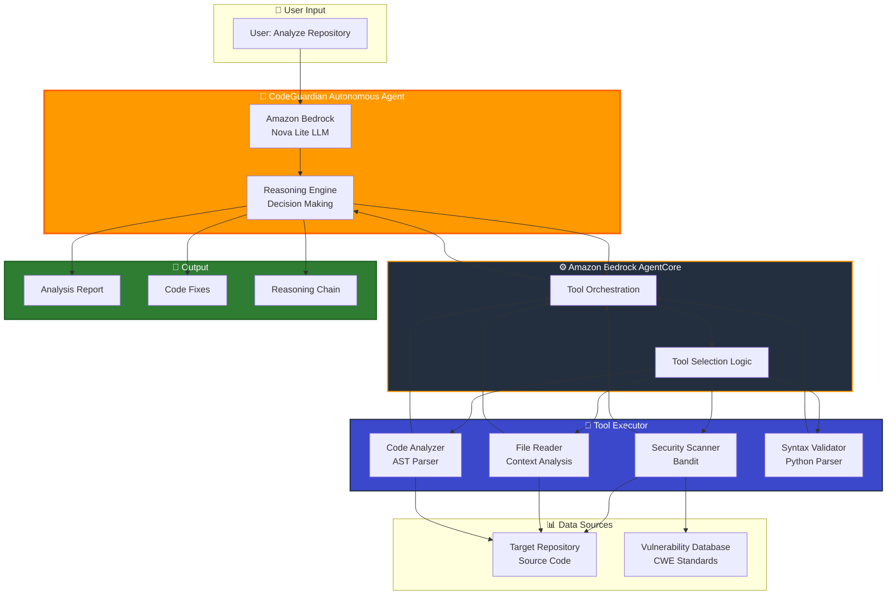
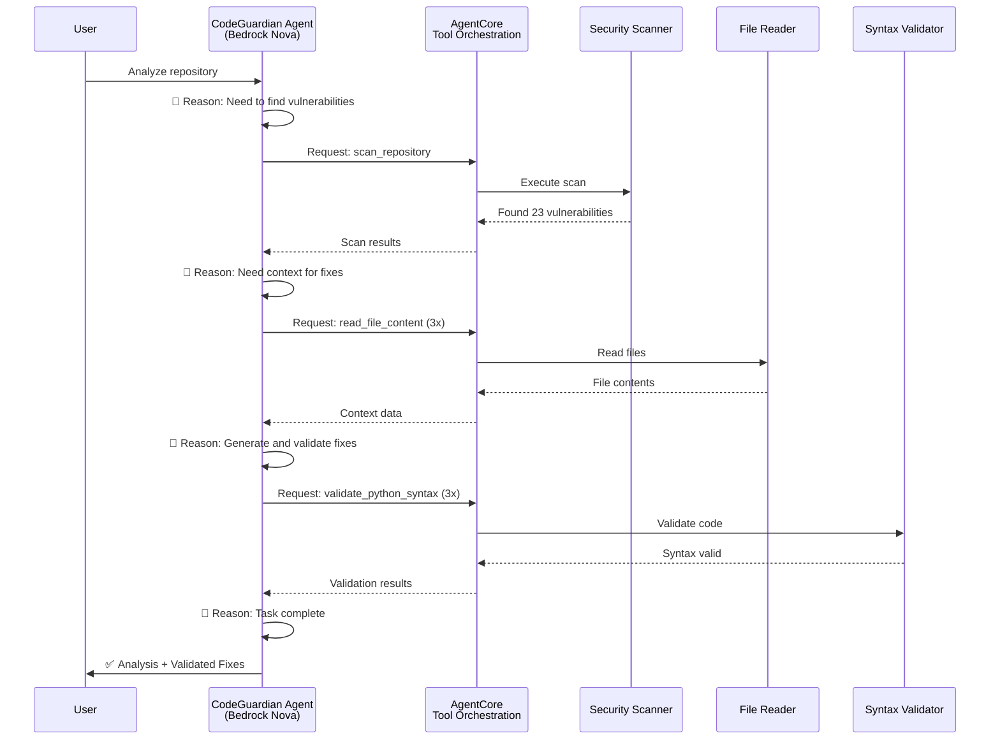
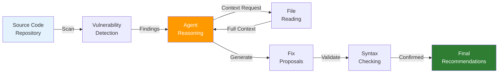
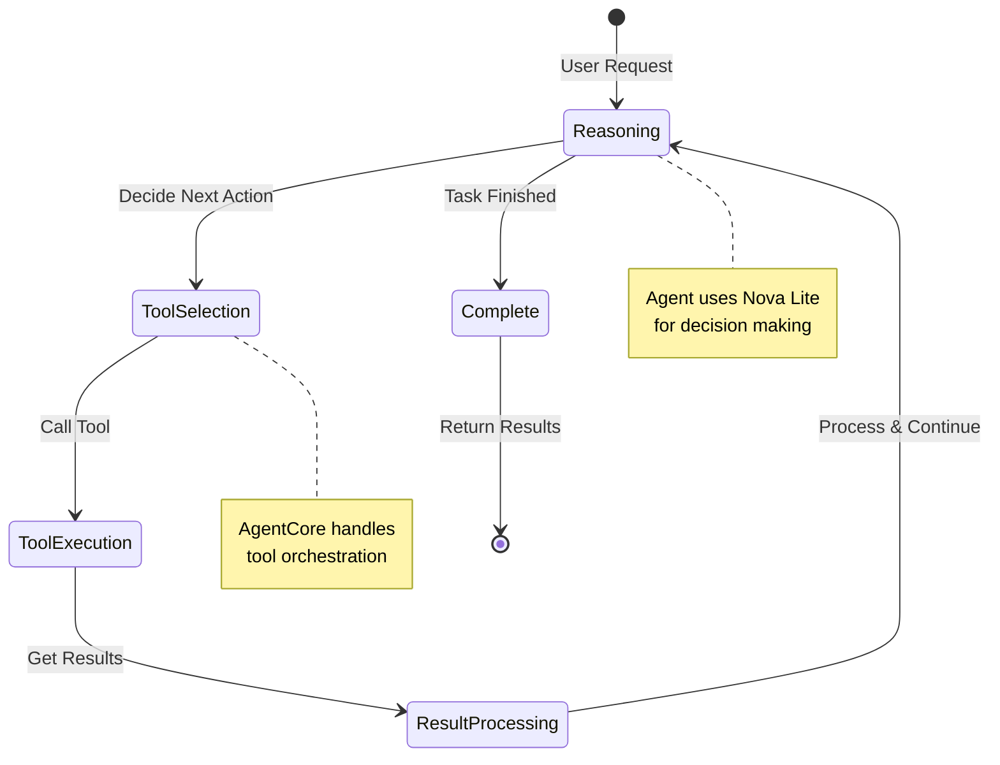

# CodeGuardian Architecture

## System Architecture Diagram

```mermaid
graph TB
    subgraph User["👤 User Input"]
        A[User: Analyze Repository]
    end

    subgraph Agent["🤖 CodeGuardian Autonomous Agent"]
        B[Amazon Bedrock<br/>Nova Lite LLM]
        C[Reasoning Engine<br/>Decision Making]
    end

    subgraph AgentCore["⚙️ Amazon Bedrock AgentCore"]
        D[Tool Orchestration]
        E[Tool Selection Logic]
    end

    subgraph Tools["🔧 Tool Executor"]
        F[Security Scanner<br/>Bandit]
        G[File Reader<br/>Context Analysis]
        H[Code Analyzer<br/>AST Parser]
        I[Syntax Validator<br/>Python Parser]
    end

    subgraph Data["📊 Data Sources"]
        J[Target Repository<br/>Source Code]
        K[Vulnerability Database<br/>CWE Standards]
    end

    subgraph Output["📝 Output"]
        L[Analysis Report]
        M[Code Fixes]
        N[Reasoning Chain]
    end

    A --> B
    B --> C
    C --> D
    D --> E
    E --> F
    E --> G
    E --> H
    E --> I
    
    F --> J
    G --> J
    H --> J
    F --> K
    
    F --> D
    G --> D
    H --> D
    I --> D
    
    D --> C
    C --> L
    C --> M
    C --> N

    style Agent fill:#ff9900,stroke:#ff6600,stroke-width:3px,color:#fff
    style AgentCore fill:#232f3e,stroke:#ff9900,stroke-width:2px,color:#fff
    style Tools fill:#3b48cc,stroke:#232f3e,stroke-width:2px,color:#fff
    style Output fill:#2e7d32,stroke:#1b5e20,stroke-width:2px,color:#fff
```

## Autonomous Workflow

```mermaid
sequenceDiagram
    participant User
    participant Agent as CodeGuardian Agent<br/>(Bedrock Nova)
    participant AgentCore as AgentCore<br/>Tool Orchestration
    participant Scanner as Security Scanner
    participant Reader as File Reader
    participant Validator as Syntax Validator

    User->>Agent: Analyze repository
    Agent->>Agent: 🧠 Reason: Need to find vulnerabilities
    Agent->>AgentCore: Request: scan_repository
    AgentCore->>Scanner: Execute scan
    Scanner-->>AgentCore: Found 23 vulnerabilities
    AgentCore-->>Agent: Scan results
    
    Agent->>Agent: 🧠 Reason: Need context for fixes
    Agent->>AgentCore: Request: read_file_content (3x)
    AgentCore->>Reader: Read files
    Reader-->>AgentCore: File contents
    AgentCore-->>Agent: Context data
    
    Agent->>Agent: 🧠 Reason: Generate and validate fixes
    Agent->>AgentCore: Request: validate_python_syntax (3x)
    AgentCore->>Validator: Validate code
    Validator-->>AgentCore: Syntax valid
    AgentCore-->>Agent: Validation results
    
    Agent->>Agent: 🧠 Reason: Task complete
    Agent->>User: ✅ Analysis + Validated Fixes
```

## Data Flow

```mermaid
flowchart LR
    A[Source Code<br/>Repository] -->|Scan| B[Vulnerability<br/>Detection]
    B -->|Findings| C[Agent<br/>Reasoning]
    C -->|Context Request| D[File<br/>Reading]
    D -->|Full Context| C
    C -->|Generate| E[Fix<br/>Proposals]
    E -->|Validate| F[Syntax<br/>Checking]
    F -->|Confirmed| G[Final<br/>Recommendations]
    
    style A fill:#e3f2fd
    style C fill:#ff9900,color:#fff
    style G fill:#2e7d32,color:#fff
```

## Tool Calling Loop

```mermaid
stateDiagram-v2
    [*] --> Reasoning: User Request
    Reasoning --> ToolSelection: Decide Next Action
    ToolSelection --> ToolExecution: Call Tool
    ToolExecution --> ResultProcessing: Get Results
    ResultProcessing --> Reasoning: Process & Continue
    Reasoning --> Complete: Task Finished
    Complete --> [*]: Return Results
    
    note right of Reasoning
        Agent uses Nova Lite
        for decision making
    end note
    
    note right of ToolSelection
        AgentCore handles
        tool orchestration
    end note
```